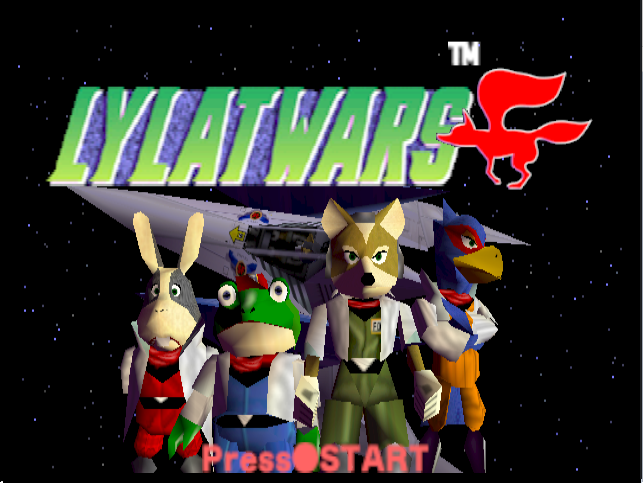
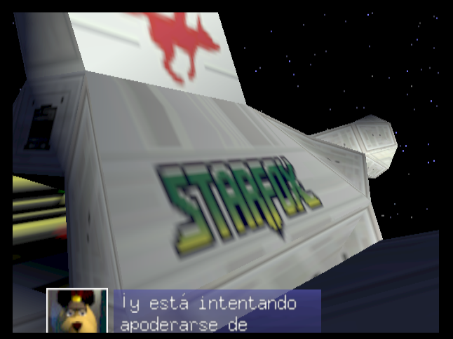
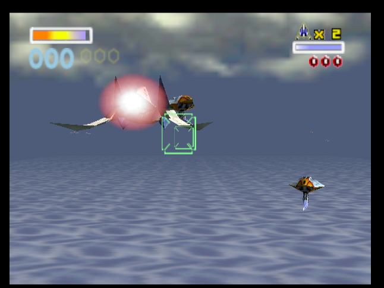
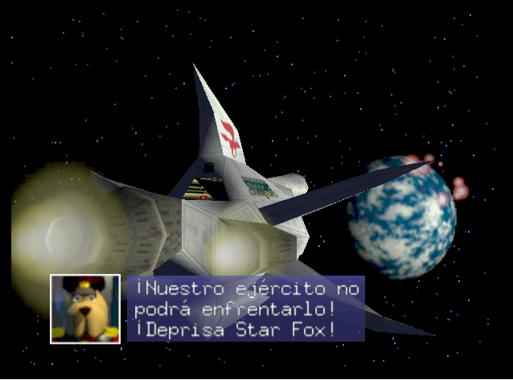
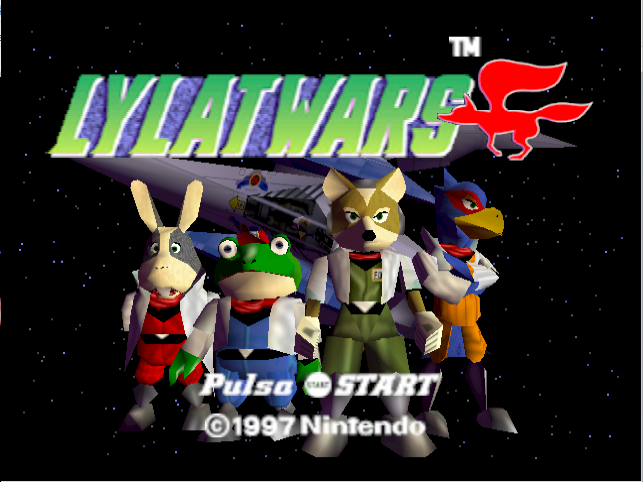
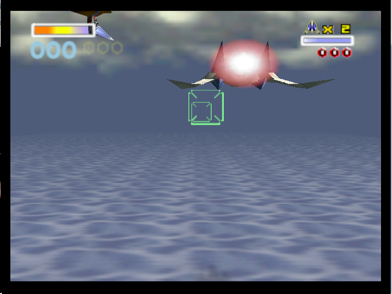

# Lylat Wars ES PAL → NTSC 60 Hz

Python patcher for a specific Spanish PAL release of **Lylat Wars (Nintendo 64)**. It converts the supported ROM to **NTSC / 60 Hz**, preserves Spanish text/audio, corrects the vertical video geometry, and recalculates the N64 checksum.

## What it changes

- Region byte: `P (0x50)` → `E (0x45)`
- NTSC `yScale`: `0x400` → `0x4CD`
- CRC1 / CRC2: recalculated using automatic CIC detection
- Original ROM: never overwritten

## Supported base ROM

```text
Format: .z64 (big-endian)
CRC1: 5F946439
CRC2: 68FA5DD1
Region: P
CIC: 7102
```

No ROM is included.

## Install

```bash
python3 -m pip install -r requirements.txt
```

## Run

```bash
python3 patcher/patch_lylat_es_ntsc.py "/path/to/Lylat wars 64 [Esp].z64"
```

Output:

```text
Lylat wars 64 [Esp]_NTSC_60Hz.z64
```

## Validated

- Project64
- Nintendo 64 NTSC
- Super 64 / ED64 Plus
- NTSC television
- Spanish text
- Spanish audio/voices
- 60 Hz gameplay
- corrected vertical geometry

## Legal

This repository contains no commercial ROMs, audio, graphics, or other game assets. Users must supply their own legally obtained ROM.

See [`docs/technical-notes.md`](docs/technical-notes.md).
## PAL → NTSC video correction

Changing the Spanish PAL ROM to NTSC was not enough by itself.
The game could run at 60 Hz, but the original PAL vertical configuration
produced incorrect vertical scaling/positioning on NTSC output.

### Before — incorrect vertical geometry

| Test 1 | Test 2 | Test 3 |
|---|---|---|
|  |  |  |

### After — corrected NTSC output

| Test 1 | Test 2 | Test 3 |
|---|---|---|
|  |  |  |

The final solution uses the tested `yScale = 0x4CD` configuration
and recalculates the N64 ROM checksums.

The resulting ROM preserves:

- Spanish text
- Spanish voices
- NTSC 60 Hz operation
- Corrected vertical geometry
- Original gameplay speed

The result was tested in Project64 and on real Nintendo 64 hardware
using a Super 64 flash cartridge.


